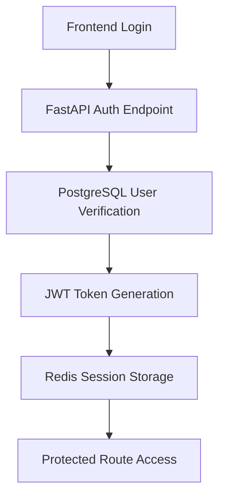
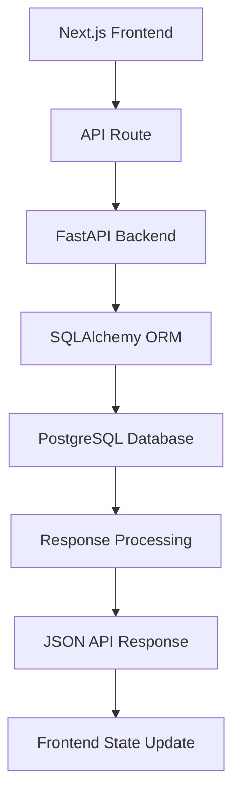
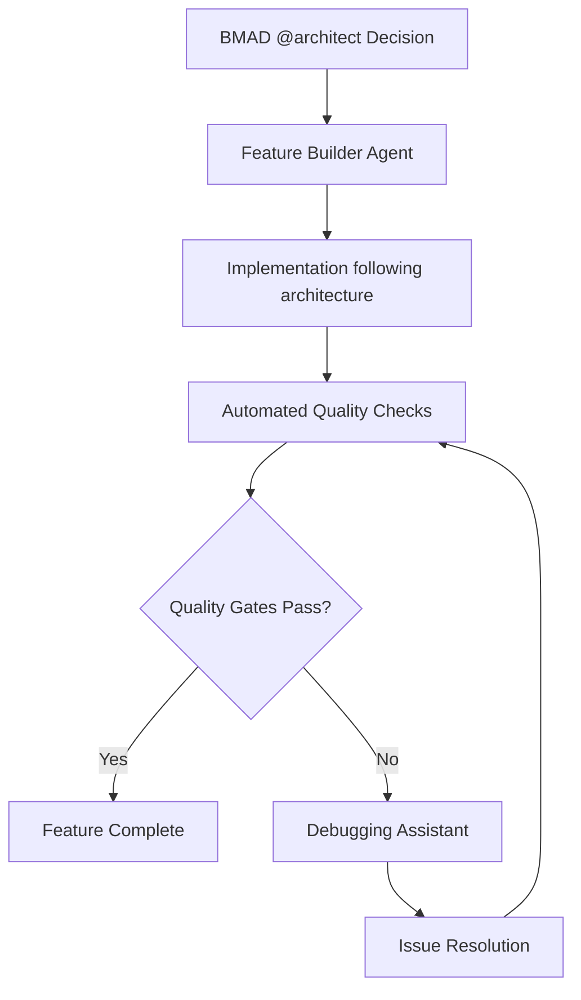

# Sol OS MVP - Technical Architecture

## Architecture Overview
**Project**: Sol OS MVP  
**Architect**: @architect (BMAD methodology)  
**Date**: 2025-08-21  
**Based on**: project-prd.md requirements

### Architecture Principles
- **BMAD Compliance**: Systematic Build-Measure-Analyze-Decide approach
- **Ecosystem Integration**: Leverage Gil's shared infrastructure and design system
- **Portfolio Quality**: Professional-grade architecture suitable for demonstration
- **Learning Oriented**: Support skill development and knowledge transfer

## System Components

### Backend Architecture (FastAPI)
```yaml
Framework: FastAPI 0.104+
Language: Python 3.11+
Database: PostgreSQL 15 with SQLAlchemy 2.0
Authentication: JWT with bcrypt password hashing
Caching: Redis for session management
Background Tasks: Celery (if needed)
API Documentation: Automatic OpenAPI/Swagger
Testing: pytest with coverage tracking
```

### Frontend Architecture (Next.js)
```yaml
Framework: Next.js 15 with App Router
Language: TypeScript 5+
Styling: Tailwind CSS with shared design system
UI Components: Shared component library (space/glass theme)
State Management: React state + Context for complex scenarios
Icons: Lucide React
Animations: Framer Motion
Testing: Jest + React Testing Library
```

### Database Architecture
```yaml
Primary Database: PostgreSQL 15
Connection: SQLAlchemy 2.0 with connection pooling
Migrations: Alembic for schema management
Schemas: sol-os-mvp_* tables with shared ecosystem patterns
Indexing: Optimized for common query patterns
Backup: Automated backup strategy (production)
```

### Infrastructure Architecture
```yaml
Development: Docker Compose with unique ports
Database: Shared PostgreSQL instance with project-specific schemas
Caching: Shared Redis instance
Reverse Proxy: Nginx for development routing
Monitoring: Health check endpoints
Deployment: Docker-based deployment strategy
```

## Data Flow Architecture

### Authentication Flow


### API Request Flow


### Development Workflow


## Integration Architecture

### Ecosystem Integration
- **Shared Design System**: Import components from ecosystem library
- **Database Patterns**: Follow established schema conventions
- **Authentication**: Consistent JWT implementation across projects
- **Infrastructure**: Integrate with shared Docker Compose services

### BMAD Integration
- **Documentation**: Complete BMAD documentation structure
- **Quality Gates**: Automated and manual quality validation
- **Decision Tracking**: Architecture decisions recorded and auditable
- **Learning Integration**: Patterns contribute to ecosystem knowledge

## Security Architecture

### Authentication & Authorization
- JWT tokens with 30-minute expiration and refresh capability
- bcrypt password hashing with appropriate salt rounds
- Role-based access control where applicable
- Secure session management with Redis storage

### Data Protection
- Input validation using Pydantic schemas
- SQL injection prevention through SQLAlchemy ORM
- CORS configuration for appropriate origins
- Environment variable security (no secrets in code)

### Development Security
- Automated security scanning in CI/CD pipeline
- Dependency vulnerability monitoring
- Secure development practices enforcement
- Regular security updates and patches

## Performance Architecture

### Backend Performance
- Asynchronous request handling with FastAPI
- Database connection pooling for efficient resource usage
- Redis caching for frequently accessed data
- Background task processing for heavy operations

### Frontend Performance
- Next.js optimization features (automatic code splitting, image optimization)
- Lazy loading for non-critical components
- Efficient state management to minimize re-renders
- Performance monitoring and optimization tracking

### Scalability Considerations
- Stateless application design for horizontal scaling
- Database indexing strategy for query optimization
- Caching strategy for reduced database load
- Load balancer ready configuration

## Quality Architecture

### Code Quality
- TypeScript strict mode for type safety
- ESLint and Prettier for consistent code formatting
- Automated testing with pytest (backend) and Jest (frontend)
- Code coverage tracking and reporting

### Architecture Quality
- Clear separation of concerns between layers
- Dependency injection for testability
- Modular design for maintainability
- Documentation generation and maintenance

### BMAD Quality Integration
- **Build**: Automated setup and configuration validation
- **Measure**: Performance metrics and quality score tracking
- **Analyze**: Code quality trends and architecture compliance
- **Decide**: Data-driven improvements and optimizations

## Technical Decisions

### Technology Stack Rationale
- **FastAPI**: Automatic API documentation, excellent Python typing support
- **Next.js 15**: Modern React framework with excellent developer experience
- **PostgreSQL**: Robust relational database with ecosystem integration
- **TypeScript**: Enhanced code quality and better development experience

### Architecture Pattern Decisions
- **API-First Design**: Clear separation between frontend and backend
- **Component-Based UI**: Reusable components with consistent design system
- **Schema-First Database**: Well-defined data models with migrations
- **Configuration-Driven**: Environment-specific configuration management

## Monitoring and Observability

### Application Monitoring
- Health check endpoints for service monitoring
- Error tracking and alerting system
- Performance metrics collection and analysis
- User experience monitoring for portfolio demonstration

### Development Monitoring
- Build success/failure tracking
- Test coverage and quality metrics
- Development velocity measurements
- BMAD process compliance tracking

## Deployment Architecture

### Development Environment
- Docker Compose for local development
- Hot reload for rapid development iteration
- Automatic database migrations
- Shared infrastructure services

### Production Considerations
- Container orchestration strategy
- Database migration and backup procedures
- Security hardening and compliance
- Performance monitoring and alerting

---

## Implementation Phases

### Phase 1: Foundation Setup
- Project structure creation with BMAD compliance
- Database schema definition and migrations
- Basic authentication implementation
- Shared component integration

### Phase 2: Core Feature Development
- Primary feature implementation following user stories
- API endpoint development with documentation
- Frontend components with design system integration
- Quality gate implementation and validation

### Phase 3: Integration and Polish
- Ecosystem integration testing
- Performance optimization and monitoring
- Security review and hardening
- Documentation completion and review

### Phase 4: Portfolio Preparation
- Professional documentation preparation
- Demo environment setup and testing
- Interview presentation materials
- Knowledge transfer documentation

---

**Next Actions**:
1. @pm: Create detailed user stories in docs/stories/
2. @dev: Begin foundation setup following this architecture
3. @qa: Define specific quality gates and testing strategy
4. Custom agents: Implement features following architectural decisions

*This architecture document will be updated as implementation progresses and new decisions are made.*