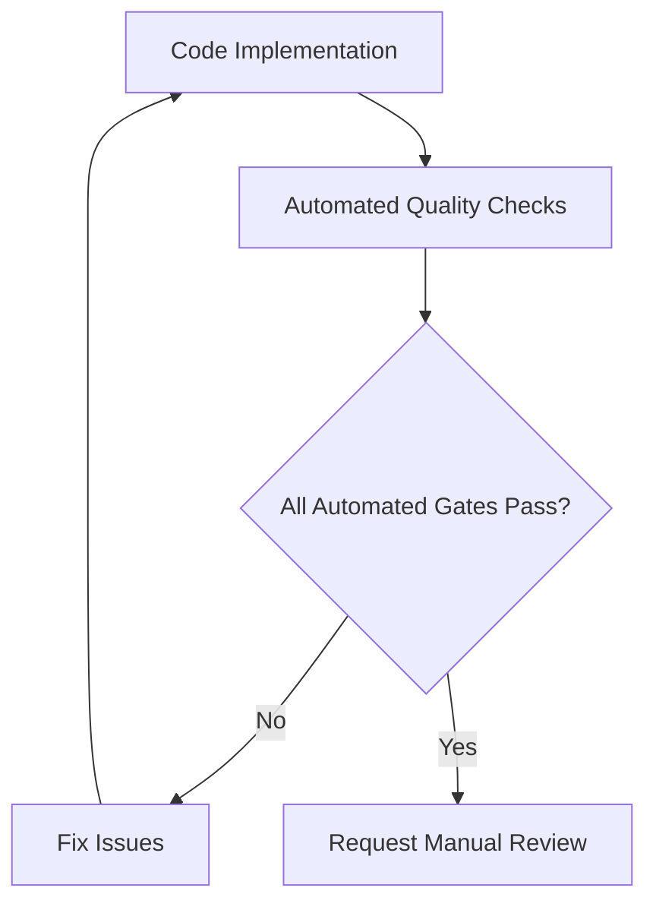
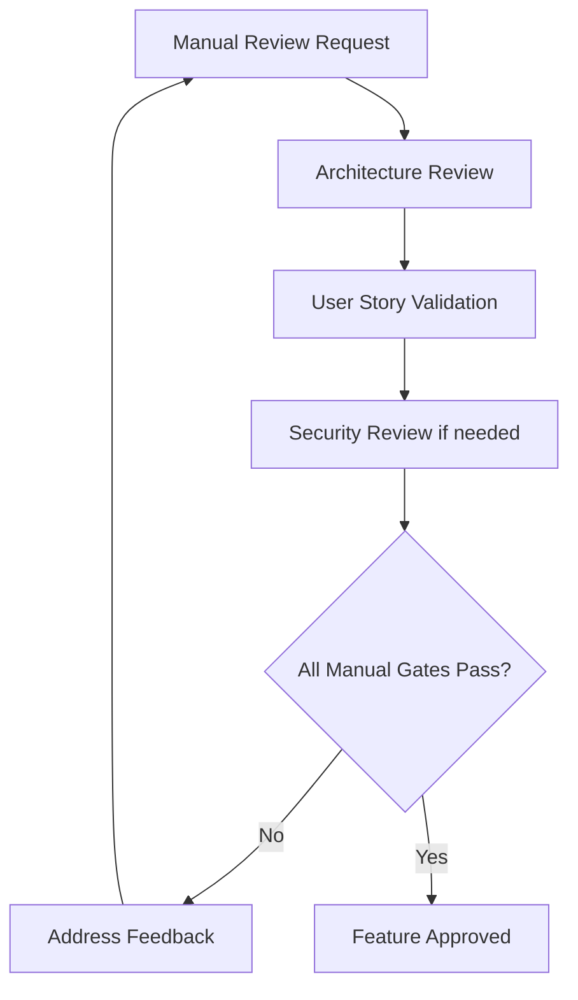
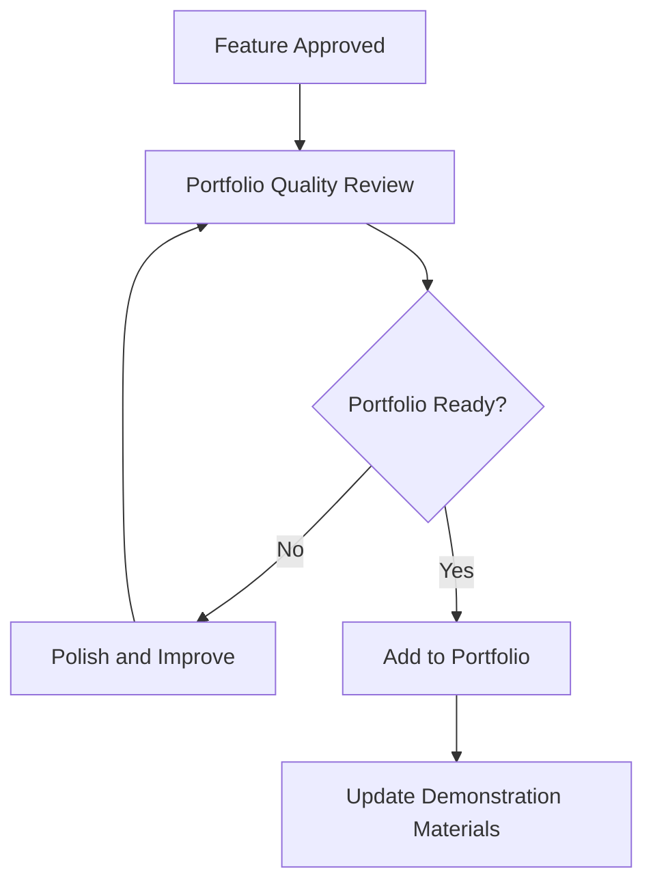

# Quality Gates - Sol OS MVP

## Overview
This document defines the quality gates that must be passed before features are considered complete and ready for portfolio demonstration.

## Automated Quality Gates

### Code Quality Gate
**Trigger**: Every commit and pull request  
**Tools**: ESLint, Prettier, mypy, TypeScript strict mode  
**Threshold**: 95% compliance score  
**Failure Action**: Block merge until issues resolved

**Checks**:
- [ ] No ESLint errors or warnings
- [ ] Code formatted with Prettier
- [ ] TypeScript strict mode compliance
- [ ] Python type hints coverage > 80%
- [ ] No unused imports or variables
- [ ] Consistent naming conventions

### Testing Gate
**Trigger**: Before feature completion  
**Tools**: pytest (backend), Jest (frontend)  
**Threshold**: 80% test coverage  
**Failure Action**: Feature incomplete until tests added

**Checks**:
- [ ] Unit tests for all business logic
- [ ] Integration tests for API endpoints
- [ ] Frontend component tests
- [ ] Edge case and error handling tests
- [ ] Performance tests for critical paths
- [ ] Test coverage meets minimum threshold

### Security Gate
**Trigger**: Weekly automated scan + manual review for auth features  
**Tools**: bandit, safety, manual security review  
**Threshold**: No high-severity vulnerabilities  
**Failure Action**: Immediate fix required

**Checks**:
- [ ] No SQL injection vulnerabilities
- [ ] Input validation and sanitization
- [ ] Authentication security best practices
- [ ] Environment variable security
- [ ] Dependency vulnerability scanning
- [ ] CORS configuration review

### Performance Gate
**Trigger**: Before feature deployment  
**Tools**: Load testing, performance profiling  
**Threshold**: API < 200ms, Frontend < 1s load time  
**Failure Action**: Optimization required

**Checks**:
- [ ] API response times within limits
- [ ] Frontend load time acceptable
- [ ] Database query optimization
- [ ] Memory usage within bounds
- [ ] No performance regressions
- [ ] Scalability considerations addressed

## Manual Quality Gates

### Architecture Compliance Review
**Reviewer**: @architect  
**Trigger**: Major feature completion  
**Artifacts**: Architecture documentation, code structure  
**Duration**: 1-2 hours per review

**Checklist**:
- [ ] Follows established architecture patterns
- [ ] Proper separation of concerns
- [ ] Consistent with ecosystem design
- [ ] Maintainable and extensible code
- [ ] Documentation updated appropriately
- [ ] Integration points properly handled

### User Story Validation
**Reviewer**: @pm  
**Trigger**: Feature implementation complete  
**Artifacts**: User story, acceptance criteria, demo  
**Duration**: 30 minutes per story

**Checklist**:
- [ ] All acceptance criteria met
- [ ] User experience meets requirements
- [ ] Feature works as designed
- [ ] Edge cases handled appropriately
- [ ] User feedback incorporated
- [ ] Documentation updated

### Portfolio Quality Review
**Reviewer**: @qa + external perspective  
**Trigger**: Before project demonstration  
**Artifacts**: Complete project, documentation, demo  
**Duration**: 2-3 hours comprehensive review

**Checklist**:
- [ ] Professional presentation quality
- [ ] Technical competency clearly demonstrated
- [ ] Code quality suitable for job interviews
- [ ] Documentation complete and professional
- [ ] Project tells compelling story
- [ ] Learning progression evident

### Security Review (Authentication Features)
**Reviewer**: @qa with security focus  
**Trigger**: Authentication-related features  
**Artifacts**: Security documentation, threat model, code review  
**Duration**: 1-2 hours per review

**Checklist**:
- [ ] Authentication flow secure
- [ ] Password handling best practices
- [ ] JWT implementation secure
- [ ] Session management appropriate
- [ ] Authorization checks in place
- [ ] Security documentation complete

## Quality Gate Workflow

### 1. Development Phase


### 2. Review Phase


### 3. Portfolio Integration


## Quality Metrics

### Code Quality Metrics
- **Lines of Code**: Track project complexity growth
- **Cyclomatic Complexity**: Maintain readability
- **Test Coverage**: Ensure thorough testing
- **Documentation Coverage**: Complete API documentation

### Process Metrics
- **Gate Pass Rate**: Percentage of features passing first review
- **Review Cycle Time**: Time from implementation to approval
- **Issue Resolution Time**: Speed of fixing quality gate failures
- **Rework Rate**: Percentage of features requiring significant changes

### Portfolio Metrics
- **Professional Readiness**: Subjective assessment of portfolio quality
- **Technical Demonstration**: Ability to explain technical decisions
- **Learning Documentation**: Evidence of skill progression
- **Interview Preparation**: Readiness for technical interviews

## Continuous Improvement

### Quality Gate Evolution
- **Weekly Review**: Assess gate effectiveness and adjust thresholds
- **Monthly Analysis**: Review quality metrics and identify improvement areas
- **Quarterly Update**: Update gates based on learning and industry standards
- **Project Retrospective**: Capture lessons learned for future projects

### Learning Integration
- **Failed Gate Analysis**: Document common issues and prevention strategies
- **Best Practice Extraction**: Identify patterns for ecosystem-wide adoption
- **Skill Development**: Track areas needing additional learning focus
- **Portfolio Enhancement**: Continuous improvement of demonstration quality

## Tool Configuration

### ESLint Configuration
```json
{
  "extends": ["next/core-web-vitals", "@typescript-eslint/recommended"],
  "rules": {
    "@typescript-eslint/no-unused-vars": "error",
    "@typescript-eslint/explicit-function-return-type": "warn"
  }
}
```

### pytest Configuration
```ini
[tool:pytest]
addopts = --cov=. --cov-report=html --cov-fail-under=80
testpaths = tests
python_files = test_*.py
python_functions = test_*
```

### TypeScript Configuration
```json
{
  "compilerOptions": {
    "strict": true,
    "noUnusedLocals": true,
    "noUnusedParameters": true,
    "exactOptionalPropertyTypes": true
  }
}
```

---

## Next Steps

1. **@qa**: Review and customize these gates for project-specific needs
2. **@dev**: Set up automated tooling and CI/CD integration
3. **@architect**: Ensure architecture review checklist is comprehensive
4. **@pm**: Align user story validation with acceptance criteria

*Quality gates will be refined based on project experience and portfolio requirements.*